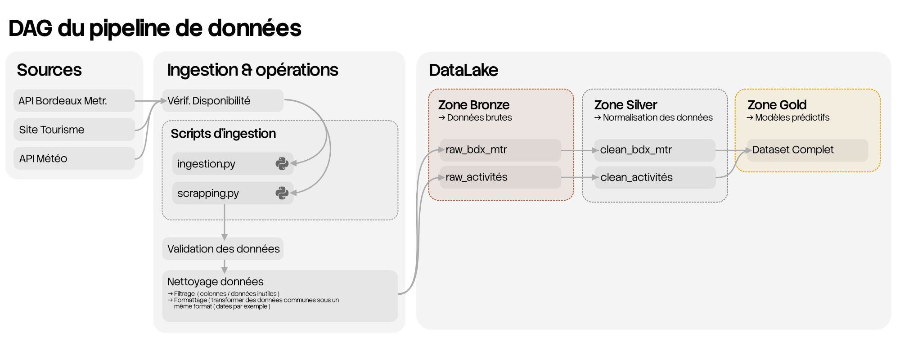

# ATELIER 1 :  
#   
## Etape 1   
établir une liste des facteurs influant plus ou moins directement sur le trafic  
routier de la rocade bordelaise. En déduire une liste par ordre décroissant d’importance de ces facteurs.  
  
- Horaire de pointe   
- Travaux   
- Accidents   
- Conditions météo  
- Événements ( match UBB ou concerts par exemple )   
- Grèves  
  
  
## Étape 2  
Pour les informations de trafic ainsi que chaque facteur identifié dans l’étape précédente, proposer une source  
de données gratuite (Open Data, ...). Préciser également si un travail spécifique (recoupement, analyse, ...) et  
ou des ressources (application, stockage, ...) sont nécessaires pour l’exploitation de ces données.  
  
données de référence ( perturbations traffic )  
[https://datahub.bordeaux-metropole.fr/explore/dataset/ci_trafi_l/information/](https://datahub.bordeaux-metropole.fr/explore/dataset/ci_trafi_l/information/)  
[https://datahub.bordeaux-metropole.fr/explore/dataset/comptage-du-trafic-2024-bordeaux-metropole/table/](https://datahub.bordeaux-metropole.fr/explore/dataset/comptage-du-trafic-2024-bordeaux-metropole/table/)  
[https://datahub.bordeaux-metropole.fr/explore/dataset/pc_capte_ponct_p/information](https://datahub.bordeaux-metropole.fr/explore/embed/dataset/pc_capte_p/table/)  
  
  
( du plus impactant au moins impactant )  
- Horaire de pointe : 
aucun jeu de données

  
- Travaux :
[https://datahub.bordeaux-metropole.fr/explore/dataset/ci_chantier/information/](https://datahub.bordeaux-metropole.fr/explore/dataset/ci_chantier/information/) -> https://datahub.bordeaux-metropole.fr/api/explore/v2.1/catalog/datasets/ci_chantier/records?limit=20
(nécéssite un clef API ) [https://opendata.bordeaux-metropole.fr/explore/dataset/ci_evenmt_p/table/](https://opendata.bordeaux-metropole.fr/explore/dataset/ci_evenmt_p/table/) -> 

  
- Accidents : 
(vieilles données) [https://datahub.bordeaux-metropole.fr/explore/dataset/accidents-corporels-de-la-circulation-sur-bordeaux-metropole-2012-2019/information](https://datahub.bordeaux-metropole.fr/explore/dataset/accidents-corporels-de-la-circulation-sur-bordeaux-metropole-2012-2019/information)
*++-> malheureusement ces données sont inexploitable car trop vieilles par rapport à mes autre jeux de données 

++*  
- Conditions météo :
aucun jeu de données

  
- Événements :
(nécéssite un clef API ) (pont chaban-delmas) [https://opendata.bordeaux-metropole.fr/explore/dataset/ci_passa_p/table/](https://opendata.bordeaux-metropole.fr/explore/dataset/ci_passa_p/table/) 
[https://datahub.bordeaux-metropole.fr/explore/dataset/met_agenda/table/](https://datahub.bordeaux-metropole.fr/explore/dataset/met_agenda/table/)
++-> à filtrer : ce jeu de données contiens tous les événements : hors seuls quelques événements exceptionnels ( match UBB / concert ) peuvent influencer le traffic ++  
	
	données filtrées :   
		• matchs rugby : [https://datahub.bordeaux-metropole.fr/explore/embed/dataset/met_agenda/table/?refine.keywords_fr=sport&refine.keywords_fr=ubb&refine.keywords_fr=top%2014&refine.keywords_fr=rugby](https://datahub.bordeaux-metropole.fr/explore/embed/dataset/met_agenda/table/?refine.keywords_fr=sport&refine.keywords_fr=ubb&refine.keywords_fr=top%2014&refine.keywords_fr=rugby) -> https://datahub.bordeaux-metropole.fr/api/explore/v2.1/catalog/datasets/met_agenda/records?select=*&where=(keywords_fr%20%3D%20%22UBB%22%20OR%20keywords_fr%20%3D%20%22Rugby%22)&limit=20  
		•   
  
  
  
- Grèves : 
aucun jeu de données 

  
-   
  
## Étape 3  
Ecrire un ou plusieurs scripts python consistant à :  
- lire ces données  
- les stocker au format parquet  
- nommer les fichiers en incluant la date  
  

# ATELIER 2 :
#
## Étape 1 
Préciser les limites que vous vous imposerez au niveau du scraping pour restreindre le risque de poursuite
juridique de la part du site.

- ne pas publier les données scrappées sur github ( ou publiquement )
- mettre un délais pour ne pas saturer les serveurs 
- ne pas vendre les données 

# ATELIER 3 :  
#

